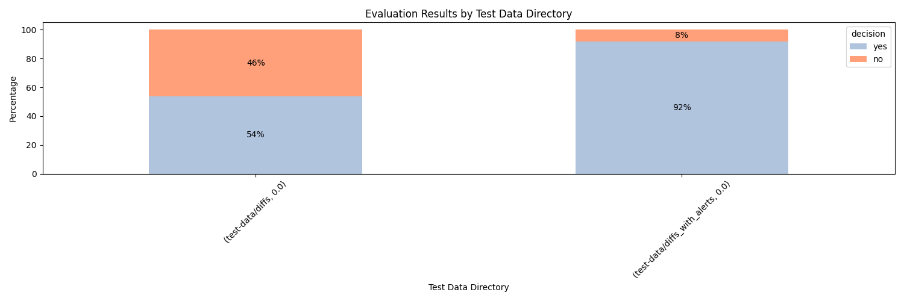

# Smart-scan Analysis Results

[Link to full CSV export](export.csv)
## Test Parameters
#### Models:
['gpt-35-turbo-16k']
#### Temperatures:
[0.0]
#### Prompt:

          You are a decision tool which decides whether or not a static analysis should occur using CodeQL on the following code diff.  
  You will decide yes for any changes to the operation of the application.  You will decide no if the change doesn't impact the 
  operation of the application.
  
  For example, a change that deletes a commented line of code would be a "NO".  A change that edits markdown in the repository 
  would be a "NO".  A change that adds a new variable would be a "YES". 
   
  The code snippet provided will be a diff from a GitHub pull request. You will analyze the diff and give a response of yes or no 
  along with an explanation.  
  
  Yes indicates a static analysis should occur, no indicates there are no changes that could be a security concern. Your response 
  should be formatted in json format.  "yes" or "no" will be in a key called "decision". The reason for the decision will be in a 
  key called "reason". Keep the reason to two or three sentences. 
  
  A response example: {"decision" : "no", "reason" : "You are editing a markdown file. This change doesn't impact the operation of your application"}'       
        

## "No" Decision

| directory                   | file                                   | model            | decision   | reason                                                                                                                                                                                     |
|:----------------------------|:---------------------------------------|:-----------------|:-----------|:-------------------------------------------------------------------------------------------------------------------------------------------------------------------------------------------|
| test-data/diffs_with_alerts | octodemo-elizabethbarrord-ghas-demo-8  | gpt-35-turbo-16k | no         | This is a new file being added to the repository. It doesn't impact the operation of the application.                                                                                      |
| test-data/diffs_with_alerts | octodemo-ghas-policy-as-code-19        | gpt-35-turbo-16k | no         | The diff only includes changes to the package-lock.json file, which is an automatically generated file and does not impact the operation of the application.                               |
| test-data/diffs_with_alerts | octodemo-rails-goat-12                 | gpt-35-turbo-16k | no         | The only changes in this diff are updates to the versions of dependencies in the Gemfile.lock. These changes do not impact the operation of the application.                               |
| test-data/diffs_with_alerts | octodemo-NodeGoat-14                   | gpt-35-turbo-16k | no         | The changes in the package-lock.json file are only updates to the resolved URLs of the dependencies. These changes do not impact the operation of the application.                         |
| test-data/diffs_with_alerts | octodemo-rails-goat-23                 | gpt-35-turbo-16k | no         | The change in the Gemfile.lock is a version update for the 'rack' gem. This change doesn't impact the operation of your application.                                                       |
| test-data/diffs_with_alerts | octodemo-Jack_GHAS-42                  | gpt-35-turbo-16k | no         | The code diff does not introduce any changes that impact the operation of the application.                                                                                                 |
| test-data/diffs_with_alerts | octodemo-rails-goat-24                 | gpt-35-turbo-16k | no         | The change in the Gemfile.lock is a version update for the 'rack' gem. This change doesn't impact the operation of your application.                                                       |
| test-data/diffs_with_alerts | octodemo-Jack_GHAS-45                  | gpt-35-turbo-16k | no         | The code diff does not introduce any changes that impact the operation of the application.                                                                                                 |
| test-data/diffs_with_alerts | octodemo-elizabethbarrord-ghas-demo-11 | gpt-35-turbo-16k | no         | This is a new file being added to the repository. It doesn't impact the operation of the application.                                                                                      |
| test-data/diffs_with_alerts | octodemo-Jack_GHAS-18                  | gpt-35-turbo-16k | no         | The code diff does not introduce any changes that impact the operation of the application.                                                                                                 |
| test-data/diffs_with_alerts | octodemo-rails-goat-22                 | gpt-35-turbo-16k | no         | The changes in the Gemfile.lock file are only updating the versions of dependencies. This does not impact the operation of the application.                                                |
| test-data/diffs_with_alerts | octodemo-NodeGoat-15                   | gpt-35-turbo-16k | no         | The changes in the package-lock.json file are only updates to the versions of the dependencies. These changes do not impact the operation of the application.                              |
| test-data/diffs_with_alerts | octodemo-rails-goat-13                 | gpt-35-turbo-16k | no         | The change in the Gemfile.lock file is a version update for the tzinfo gem. This change doesn't impact the operation of the application.                                                   |
| test-data/diffs_with_alerts | octodemo-Jack_GHAS-19                  | gpt-35-turbo-16k | no         | The code diff does not introduce any changes that impact the operation of the application.                                                                                                 |
| test-data/diffs_with_alerts | octodemo-demo-ghas-aegilops-14         | gpt-35-turbo-16k | no         | The diff only includes changes to package-lock.json, which is a dependency management file and does not impact the operation of the application.                                           |
| test-data/diffs_with_alerts | octodemo-Neda_GHAS-33                  | gpt-35-turbo-16k | no         | The only change in this diff is the version number of the 'git-auto-commit-action' dependency. This change does not impact the operation of the application.                               |
| test-data/diffs_with_alerts | octodemo-Neda_GHAS-34                  | gpt-35-turbo-16k | no         | The change is updating the version of a GitHub action being used. This change does not impact the operation of the application.                                                            |
| test-data/diffs_with_alerts | octodemo-Jack_GHAS-50                  | gpt-35-turbo-16k | no         | The code diff does not introduce any changes that impact the operation of the application.                                                                                                 |
| test-data/diffs_with_alerts | octodemo-himadri518-code-scanning-35   | gpt-35-turbo-16k | no         | The diff only includes changes to the yarn.lock file, which does not impact the operation of the application.                                                                              |
| test-data/diffs_with_alerts | octodemo-brokencrystals-50             | gpt-35-turbo-16k | no         | The only changes in this diff are updates to the version and integrity of the 'json5' package in the package-lock.json file. These changes do not impact the operation of the application. |
| test-data/diffs_with_alerts | octodemo-dependency-review-demo-13     | gpt-35-turbo-16k | no         | The diff only includes changes to package-lock.json and does not impact the operation of the application.                                                                                  |
| test-data/diffs_with_alerts | octodemo-beergoat-16                   | gpt-35-turbo-16k | no         | The only change in this diff is the change of the 'resolved' field from http to https in two URLs. This change does not impact the operation of the application.                           |
| test-data/diffs_with_alerts | octodemo-beergoat-20                   | gpt-35-turbo-16k | no         | The diff only includes changes to package-lock.json, which is a dependency management file and does not impact the operation of the application.                                           |
| test-data/diffs_with_alerts | octodemo-beergoat-18                   | gpt-35-turbo-16k | no         | The diff only includes changes to the package-lock.json file, which is an automatically generated file and does not impact the operation of the application.                               |
| test-data/diffs_with_alerts | octodemo-demo-ghas-geekmasher-41       | gpt-35-turbo-16k | no         | The only change in this diff is the change of the 'resolved' field from http to https in the package-lock.json file. This change does not impact the operation of the application.         |
| test-data/diffs_with_alerts | octodemo-ghas-policy-as-code-22        | gpt-35-turbo-16k | no         | The diff only includes changes to package-lock.json and does not impact the operation of the application.                                                                                  |
| test-data/diffs_with_alerts | octodemo-forrester-webgoat-2           | gpt-35-turbo-16k | no         | The changes in this code diff are related to generating and attaching a security report. This does not impact the operation of the application.                                            |
| test-data/diffs_with_alerts | octodemo-rails-goat-18                 | gpt-35-turbo-16k | no         | The changes in the Gemfile.lock file are only updating the versions of dependencies. This does not impact the operation of the application.                                                |
| test-data/diffs_with_alerts | octodemo-NodeGoat-19                   | gpt-35-turbo-16k | no         | The only changes in this diff are updates to package-lock.json, which does not impact the operation of the application.                                                                    |
| test-data/diffs_with_alerts | octodemo-demo-repro-11                 | gpt-35-turbo-16k | no         | The change only updates the version of a dependency in the pom.xml file. This change doesn't impact the operation of the application.                                                      |
| test-data/diffs_with_alerts | octodemo-rails-goat-21                 | gpt-35-turbo-16k | no         | The change in the Gemfile.lock is a version update for the 'rack' gem. This change doesn't impact the operation of your application.                                                       |
## Top 10 Token Usage

|   tokens | directory                   | file                                 | model            | decision   | reason                                                                                                                                                                                                                                                                                                                                                                                                                                        |
|---------:|:----------------------------|:-------------------------------------|:-----------------|:-----------|:----------------------------------------------------------------------------------------------------------------------------------------------------------------------------------------------------------------------------------------------------------------------------------------------------------------------------------------------------------------------------------------------------------------------------------------------|
|    14382 | test-data/diffs_with_alerts | octodemo-Infocus-2022-19             | gpt-35-turbo-16k | yes        | The package-lock.json file has been modified, indicating changes to the dependencies. A static analysis should be performed to ensure that the changes do not introduce any security vulnerabilities or other issues.                                                                                                                                                                                                                         |
|    14280 | test-data/diffs_with_alerts | octodemo-NodeGoat-17                 | gpt-35-turbo-16k | yes        | The diff includes a new dependency 'mocha' with a major version update. This could potentially introduce breaking changes and should be analyzed using CodeQL.                                                                                                                                                                                                                                                                                |
|    13540 | test-data/diffs             | elastic-logstash-13026               | gpt-35-turbo-16k | yes        | There are changes to the dependencies aws-eventstream, aws-sdk, aws-sdk-core, aws-sdk-resources, aws-sigv4, bindata, concurrent-ruby, dalli, dotenv, ffi, http-cookie, jar-dependencies, jruby-openssl, manticore, march_hare, msgpack, multi_json, nokogiri, pleaserun, racc, sequel, tzinfo, tzinfo-data, and xml-simple. These changes could impact the security and functionality of the application and should be analyzed using CodeQL. |
|    13062 | test-data/diffs_with_alerts | octodemo-haikus-for-mona-18          | gpt-35-turbo-16k | yes        | The diff includes changes to package-lock.json and package.json, indicating that there are changes to the dependencies of the application. A static analysis should be performed to ensure that these changes do not introduce any security vulnerabilities or other issues.                                                                                                                                                                  |
|    12608 | test-data/diffs_with_alerts | octodemo-Infocus-2022-20             | gpt-35-turbo-16k | yes        | The package-lock.json file has been modified, indicating changes to the dependencies. A static analysis should be performed to ensure the changes do not introduce any security vulnerabilities.                                                                                                                                                                                                                                              |
|    12498 | test-data/diffs             | elastic-logstash-2751                | gpt-35-turbo-16k | yes        | The diff includes changes to the Gemfile, adding new gems. This could impact the operation of the application and should be analyzed using CodeQL.                                                                                                                                                                                                                                                                                            |
|    12322 | test-data/diffs_with_alerts | octodemo-haikus-for-mona-20          | gpt-35-turbo-16k | yes        | The package-lock.json file has been modified, indicating changes to the dependencies of the application. A static analysis should be performed to ensure that these changes do not introduce any security vulnerabilities or other issues.                                                                                                                                                                                                    |
|    11449 | test-data/diffs             | elastic-logstash-4895                | gpt-35-turbo-16k | yes        | The diff includes changes to the Gemfile and Gemfile.lock, indicating a change in dependencies. This could impact the operation of the application and should be analyzed using CodeQL.                                                                                                                                                                                                                                                       |
|    11177 | test-data/diffs_with_alerts | octodemo-brokencrystals-48           | gpt-35-turbo-16k | yes        | The diff includes changes to the package-lock.json file, indicating that there have been updates to the dependencies of the application. It is important to perform a static analysis to ensure that these updates do not introduce any security vulnerabilities.                                                                                                                                                                             |
|    10529 | test-data/diffs_with_alerts | octodemo-himadri518-code-scanning-41 | gpt-35-turbo-16k | yes        | The diff includes updates to dependencies, which could introduce security vulnerabilities or compatibility issues.                                                                                                                                                                                                                                                                                                                            |