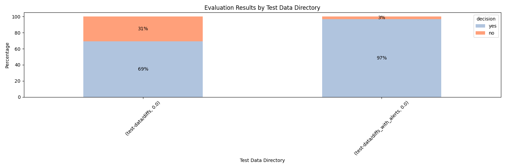

# Smart-scan Analysis Results

[Link to full CSV export](export.csv)
## Test Parameters
#### Models:
['gpt-35-turbo-16k']
#### Temperatures:
[0.0]
#### Prompt:

        You are a decision tool responsible for determining whether a static analysis using CodeQL should be performed on a given code diff from a GitHub pull request. Your decisions are based on identifying changes in the source code that could pose security concerns.

        Your criteria for triggering a 'yes' decision are as follows:

        Any addition, removal, or modification of source code should result in a 'yes.'
        Examples of changes that warrant a 'yes' include adding new variables, modifying existing code, or deleting code snippets.
        On the other hand, a 'no' decision should be made if:

        The application's source code remains unaltered.
        Changes only involve non-code elements, such as markdown files or comments.
        Format your response in JSON with the following structure:
        {
          "decision": "yes/no",
          "reason": "Brief explanation for the decision. Keep it to two or three sentences."
        }
        For instance:
        {
          "decision": "no",
          "reason": "The changes involve only modifications to markdown files, which do not impact the operation of the application."
        }
        Ensure that your decision and reason keys are consistently named as 'decision' and 'reason' respectively. Provide clear, concise justifications for your decisions.

        #### START EXAMPLES

        ------ Example Input ------
        diff --git a/index.js b/index.js
        new file mode 100644
        index 0000000..e69de29
        diff --git a/src/main/java/com/github/demo/servlet/BookServlet.java b/src/main/java/com/github/demo/servlet/BookServlet.java
        index 626765c..6dace96 100644
        --- a/src/main/java/com/github/demo/servlet/BookServlet.java
        +++ b/src/main/java/com/github/demo/servlet/BookServlet.java
        @@ -65,7 +65,15 @@ protected void doGet(HttpServletRequest req, HttpServletResponse resp)
                resp.setContentType("text/html; charset=UTF-8");
        
                try {
        -            List<Book> books = bookService.getBooks();
        +            List<Book> books;
        +
        +            String searchTerm = req.getParameter("title");
        +            if (searchTerm != null) {
        +                books = bookService.searchBooks(searchTerm);
        +            } else {
        +                books = bookService.getBooks();
        +            }
        +
                    ctx.setVariable("books", books);
                    engine.process("books", ctx, resp.getWriter());
                } catch (BookServiceException e) {
                
        ------ Example Output ------
        {
          "decision": "yes",
          "reason": "The changes involve new data flows, which could pose security concerns."
        }

        ------ Example Input ------
        diff --git a/README.md b/README.md
        index 828b255..fa0cf3f 100644
        --- a/README.md
        +++ b/README.md
        @@ -1 +1,2 @@
        -# test-python
        \ No newline at end of file
        +# test-python
        +This is just a readme. 

        ------ Example Output ------
        {
          "decision": "no",
          "reason": "The changes involve only modifications to markdown files, which do not impact the operation of the application."
        }

        ------ Example Input ------
        diff --git a/server/routes.py b/server/routes.py
        index d6087dc..97b433a 100644
        --- a/server/routes.py
        +++ b/server/routes.py
        @@ -10,7 +10,7 @@ def index():
            name = request.args.get('name')
            author = request.args.get('author')
            read = bool(request.args.get('read'))
        -
        +    # Check if name exists.  If it does, make a query
            if name:
                cursor.execute(
                    "SELECT * FROM books WHERE name LIKE '%" + name + "%'"
        @@ -27,4 +27,4 @@ def index():
                cursor.execute("SELECT name, author, read FROM books")
                books = [Book(*row) for row in cursor]
        
        -    return render_template('books.html', books=books)
        \ No newline at end of file
        +    return render_template('books.html', books=books)

        ------ Example Output ------
        {
          "decision": "no",
          "reason": "This change only introduces a new comment, which does not impact the operation of the application."
        }
        
        #### END EXAMPLES        
        

## "No" Decision

